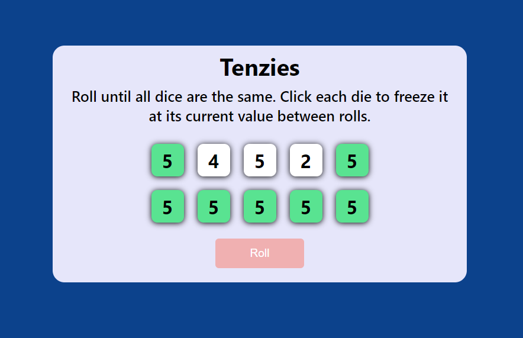
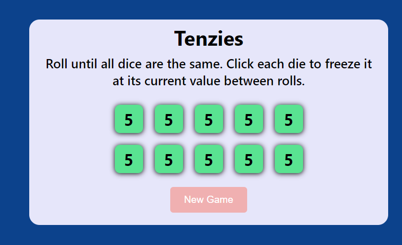

# Tenzies

The Tenzi dice game made with JavaScript and React.

## Contents

- [Features](#features)
- [Installation](#installation)
- [Functionality and Screenshots](#functionality-and-screenshots)
- [Credits](#credits)

## Features

- Play the dice game Tenzi by clicking the "Roll" button.
- Any die that hasn't been held will re-roll into a new number.
- This loop continues until all ten of your die are held and are of the same number, at which point you win the game.
- Clicking the roll button again will start a fresh game.

## Installation

In the project directory, you can run:

### `npm start`

Runs the app in the development mode.\
Open [http://localhost:3000](http://localhost:3000) to view it in your browser.

The page will reload when you make changes.\
You may also see any lint errors in the console.

### `npm test`

Launches the test runner in the interactive watch mode.\
See the section about [running tests](https://facebook.github.io/create-react-app/docs/running-tests) for more information.

### `npm run build`

Builds the app for production to the `build` folder.\
It correctly bundles React in production mode and optimizes the build for the best performance.

The build is minified and the filenames include the hashes.\
Your app is ready to be deployed!

See the section about [deployment](https://facebook.github.io/create-react-app/docs/deployment) for more information.

### `npm run eject`

**Note: this is a one-way operation. Once you `eject`, you can't go back!**

If you aren't satisfied with the build tool and configuration choices, you can `eject` at any time. This command will remove the single build dependency from your project.

Instead, it will copy all the configuration files and the transitive dependencies (webpack, Babel, ESLint, etc) right into your project so you have full control over them. All of the commands except `eject` will still work, but they will point to the copied scripts so you can tweak them. At this point you're on your own.

You don't have to ever use `eject`. The curated feature set is suitable for small and middle deployments, and you shouldn't feel obligated to use this feature. However we understand that this tool wouldn't be useful if you couldn't customize it when you are ready for it.

## Functionality and Screenshots

*Tenzi - In Progress*

A game of Tenzi in progress, with some die being held (green)
- The roll button can be pressed at the bottom, and all die will be re-rolled except the ones the user has clicked on, marked in green.
- The goal is to get all ten die to be the same number.
- Once all 10 die are green, or is being held, the game ends.

*Tenzi - End State*

The end state of the Tenzi dice game.
- All die are the same number and have been held (marked in green) and so the game is over.
- The roll button text changes to a "New Game" prompt, which once clicked will re-roll all the numbers and no die will be held by the player.

## Credits

### Tools

- JavaScript
- React
- CSS
- HTML

[Back to Top](#contents)
